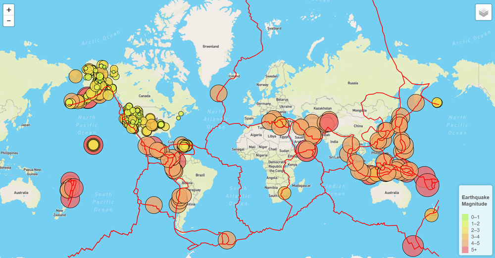
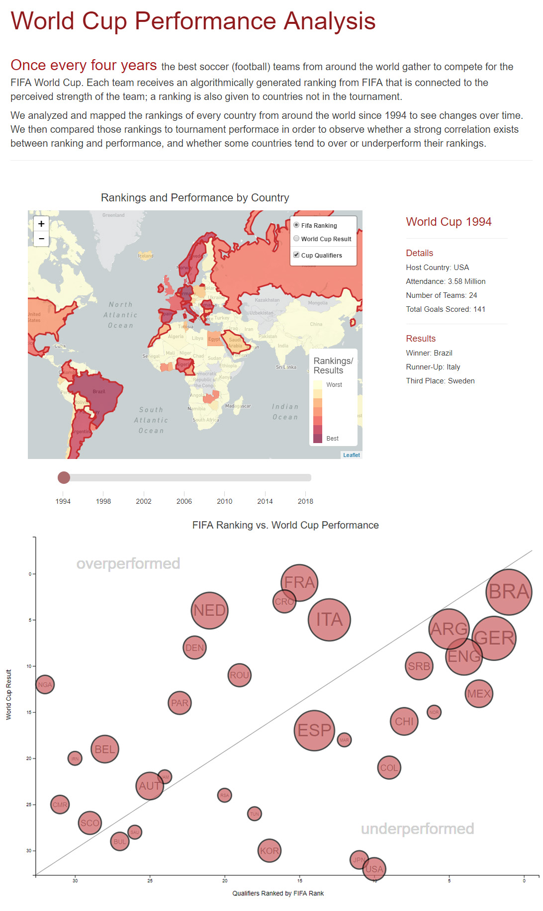

Below are some examples of front end, back end, and full stack data analysis and data visualization programs and web apps that I've put together

## Font End
---

### World Map of Earthquakes

<!-- 

    <iframe class="resp-iframe" src="http://www.aaronburke.net/earthquakes/index.html" allowfullscreen></iframe>

 -->

Full working app: [www.aaronburke.net/earthquakes/index.html](http://www.aaronburke.net/earthquakes/index.html)

[GitHub repo](https://github.com/imtheaaron/imtheaaron.github.io/tree/master/earthquakes)

**Technologies:** JavaScript, Leaflet, GeoJson, API calls

This program queries the US Geological Survey for a GeoJson of all earthquakes in the past 7 days. Using JavaScript and Leaflet, each earthquake is then mapped with the color and size of each circle relative to the magnitude of the earthquake. A user can also select to display lines of tectonic plates, and each earthquake circle is clickable which will display additional information.

## Full Stack
---

### FIFA World Cup Rankings and Performance Analysis

[GitHub repo](https://github.com/imtheaaron/World-Cup-Analysis)

**Technologies:** sqlite, Python, Flask, D3, Javascript, GeoJson, Leaflet, Bootstrap

This full-stack application is built on a sqlite database backend. API routes were created in Python using Flask; these routes were then called in JavaScript to build an interactive map using Leaflet, and an interactive scatterplot of rankings vs. World Cup Performance using D3, along with information on the World Cup for that year. The frontend layout was done using the Bootstrap framework.

Using a slider, a World Cup year can be selected and data from that year can be viewed. The map can be overlaid with every country's FIFA ranking, along with World Cup performance for each team that made the World Cup. The slider will also modify the scatterplot, where the tournament performance of all World Cup teams are plotted vs. entering ranking to view which teams over or under-performed. The data goes up to (but not including) World Cup 2018.
